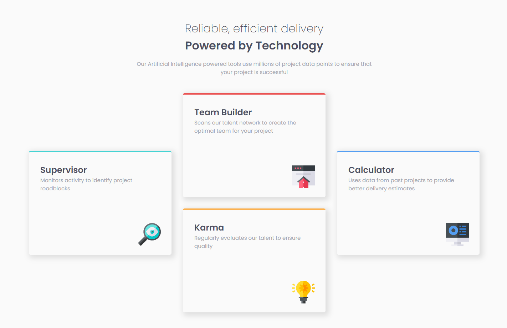

# Frontend Mentor - Four card feature section solution

This is a solution to the [Four card feature section challenge on Frontend Mentor](https://www.frontendmentor.io/challenges/four-card-feature-section-weK1eFYK). Frontend Mentor challenges help you improve your coding skills by building realistic projects. 

## Table of contents

- [Frontend Mentor - Four card feature section solution](#frontend-mentor---four-card-feature-section-solution)
  - [Table of contents](#table-of-contents)
  - [Overview](#overview)
    - [The challenge](#the-challenge)
    - [Screenshot](#screenshot)
    - [Links](#links)
    - [Built with](#built-with)
    - [What I learned](#what-i-learned)
    - [Continued development](#continued-development)
    - [Useful resources](#useful-resources)
  - [Author](#author)

## Overview

### The challenge

Users should be able to:

- View the optimal layout for the site depending on their device's screen size

### Screenshot



### Links

- Solution URL: [Frontend Mentor](https://github.com/justinnvera/four-card-feature-section)
- Live Site URL: [Vercel](https://four-card-feature-section-jet-nine.vercel.app)

### Built with

- Semantic HTML5 markup
- CSS custom properties
- Flexbox
- CSS Grid
- 
### What I learned

I learned how to use CSS variables to cut down on texts of code and hassle.

```css
:root {
    --red: hsl(0, 78%, 62%);
    --cyan: hsl(180, 62%, 55%);
    --orange: hsl(34, 97%, 64%);
    --blue: hsl(212, 86%, 64%);
    --very-dark-blue: hsl(234, 12%, 34%);
    --grayish-blue: hsl(229, 6%, 66%);
    --very-light-gray: hsl(0, 0%, 98%);
}
```
### Continued development

I want to find more ways to cut down on code whether that's using utility classes or CSS variables.

### Useful resources

- [Box-shadow Generator ](https://html-css-js.com/css/generator/box-shadow/) - The box shadow CSS styling I used was from this website. 

## Author

- Website - [Justin Vera](https://www.justinvera.com)
- Frontend Mentor - [@justinnvera](https://www.frontendmentor.io/profile/justinnvera)
